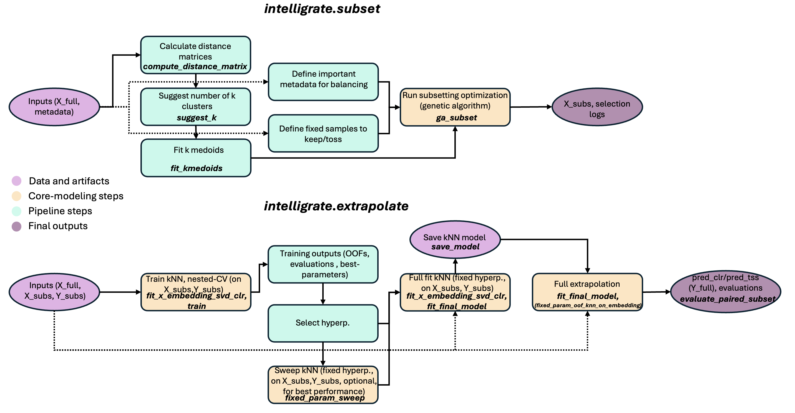

# intelligrate

**Design representative data subsets** (e.g., for shotgun sequencing) **and extrapolate the follow-up results back to the full cohort** (e.g., predict KO profiles from amplicon k-mers) — one Python package, two workflows.

## What Intelligrate does

### 1) `subset`
Select a *diversity- and metadata-balanced* subset of samples that still represents your full dataset well.

**Typical use case:** choose samples for, e.g., more cost- and/or time-expensive follow-up assays (shotgun, metabolomics, isolate screening, long-reads).


### 2) `extrapolate`
Learn a mapping from a *starting layer* (e.g., amplicon marker gene k-mers) to a *follow-up layer* (e.g., shotgun-derived KO profiles) on a subset of paired samples, then predict follow-up profiles for the full dataset.

**Typical use case:** infer KO profiles for all samples when only a subset has shotgun sequencing data.
 
 
---

## Why these two workflows belong together

1. **Sometimes, you cannot follow up everything.** `subset` helps you pick the most informative samples under cost/time/capacity constraints.  
2. **You still want cohort-wide insights.** `extrapolate` uses the paired subset to predict follow-up profiles for the full dataset.  
3. **End-to-end reproducibility.** The workflows allow you to reproducibly select representative subsets and extrapolate findings from the subsets back to the full dataset through transparent fine-tuning and evaluation of prediction performance.

---

## Table of contents
- [Install](#install)
- [CLI entry points](#cli-entry-points)
- [Quickstart: subset](#quickstart-subset)
- [Quickstart: extrapolate](#quickstart-extrapolate)
- [Tutorials and notebooks](#tutorials-and-notebooks)
- [Input table formats](#input-table-formats)
- [Outputs](#outputs)
- [Parameter guide](#parameter-guide)
- [Release notes](#release-notes)

---

## Install

Install the Python package when you want to use `intelligrate` on your own data.

### Choose an environment
Recommended: create a dedicated environment, then install Intelligrate there.

Using `venv`:
```bash
python -m venv intelligrate-env
source intelligrate-env/bin/activate
python -m pip install --upgrade pip
pip install intelligrate
```

Using conda or mamba:
```bash
conda create -n intelligrate python=3.11
conda activate intelligrate
pip install intelligrate
```

If you already have a suitable Python environment active, install directly into it:
```bash
pip install intelligrate
```

Optional map dependencies for geographic plots in the subset notebooks:
```bash
pip install "intelligrate[maps]"
```

### From a GitHub tag
```bash
pip install "intelligrate @ git+https://github.com/anninameyer/Intelligrate.git@v0.1.0"
```

Optional map dependencies for geographic plots in the subset notebooks:
```bash
pip install "intelligrate[maps] @ git+https://github.com/anninameyer/Intelligrate.git@v0.1.0"
```

The PyPI/package install contains the library code. Example notebooks, configs, and example data
are kept in the GitHub repository so they can be downloaded separately.

### Run examples without cloning
You do not need to clone the full repository to run a tutorial. Create a working folder, install
`intelligrate` in that environment, then download the notebook and the matching example data folder
from GitHub.

Recommended layout:
```text
your_working_folder/
  02_extrapolate_train_evaluate_full_fit_predict_HF_sourdough.ipynb
  data/HF_sourdough/
    X_kmers.tsv
    X_kmers_full.tsv
    Y_kos.tsv
    picrust2_kos.tsv
    ko_to_superclass.tsv
  results/                         # created by notebooks/scripts
```

For the subset tutorial, use the same pattern with
`01_subset_kmedoids_ga_selection.ipynb` and at least:
```text
data/HF_sourdough/feature_table_rel.tsv
data/HF_sourdough/metadata.tsv
```

Start Jupyter from `your_working_folder/` and select the environment where you installed
`intelligrate`.

### Development install
Clone only if you want to modify Intelligrate itself:
```bash
git clone https://github.com/anninameyer/Intelligrate.git
cd Intelligrate
pip install -e ".[dev]"
```

## CLI entry points

Installing `intelligrate` exposes these console commands:

```bash
intelligrate-subset --config configs/subset_ga.yaml
intelligrate-extrapolate-train --config configs/default.yaml
intelligrate-extrapolate-fixed-param-sweep --config configs/default.yaml --out results/fixed_param_sweep.tsv
intelligrate-extrapolate-full-fit --help
intelligrate-extrapolate-full-predict --help
```

The same functionality is available through the Python API in the quickstarts below and in the
example notebooks. If you are running a notebook-only example after `pip install intelligrate`, you
do not need these CLI commands unless you prefer config-driven runs.

## Quickstart: subset
Full runnable example in the provided [Tutorials and notebooks](#tutorials-and-notebooks).

**Rationale:** pick a subset that is (i) diverse in feature space, (ii) spatially spread (optional), and (iii) balanced across key metadata.

```
python - <<'PY'
from pathlib import Path
import pandas as pd
from intelligrate.subset import compute_distance_matrix, suggest_k, fit_kmedoids, ga_subset

dataset_dir = Path("data/HF_sourdough")
results_dir = Path("results/HF_sourdough/subset")
results_dir.mkdir(parents=True, exist_ok=True)

ft = pd.read_csv(dataset_dir / "feature_table_rel.tsv", sep="\t", index_col=0)  # samples x features
md = pd.read_csv(dataset_dir / "metadata.tsv", sep="\t", index_col=0)           # samples x metadata

# 1) distances
D = compute_distance_matrix(ft, metric="bray", assume_relative=True)

# 2) (optional) pick a reasonable k via diagnostics
_ = suggest_k(D, ft, k_range=range(2, 8), gap_B=3, random_state=42)

# 3) cluster and run GA subset selection
kmed = fit_kmedoids(D, k=5, random_state=42)

selected, best_scores, fitness = ga_subset(
    cluster_df=kmed["cluster_df"],
    metadata_df=md,
    total_samples=30,
    balance_vars=["r_samp_country", "r_samp_source", "hub"],
    coord_vars=("latitude", "longitude"),
    population_size=30,
    generations=20,
    random_state=42,
)

selected.to_csv(results_dir / "ga_selected_samples.tsv", sep="\t")
PY

```

## Quickstart: extrapolate
Full runnable example in the provided [Tutorials and notebooks](#tutorials-and-notebooks).

**Rationale:** fit on paired samples (X → Y), then predict Y for all samples with only X (e.g., predict KO profiles from marker gene amplicons).

Optional stability step: run `fixed_param_sweep` to find a **single fixed hyperparameter set**
that performs best in leakage‑free OOF (see tutorial).

```
python - <<'PY'
from pathlib import Path
import joblib
import pandas as pd
from intelligrate.extrapolate.embedding import fit_x_embedding_svd_clr
from intelligrate.extrapolate.full_fit import fit_final_model, save_model
from intelligrate.extrapolate.full_predict import predict_final_model

# X_full: all samples with amplicon k-mers
# X: paired subset (same feature space), matched to Y rows
# Y: KO profiles (TPM/TSS) for paired subset
dataset_dir = Path("data/HF_sourdough")
results_dir = Path("results/HF_sourdough")
results_dir.mkdir(parents=True, exist_ok=True)

X_full = pd.read_csv(dataset_dir / "X_kmers_full.tsv", sep="\t", index_col=0)
X      = pd.read_csv(dataset_dir / "X_kmers.tsv",      sep="\t", index_col=0)
Y      = pd.read_csv(dataset_dir / "Y_kos.tsv",        sep="\t", index_col=0)

# 1) fit reusable X embedding on the full X feature space
embed = fit_x_embedding_svd_clr(
    X_full,
    min_prev_x_abs=14,
    pseudocount_x=0.5,
    n_components=128,
    seed=0,
)
joblib.dump(embed, results_dir / "embed.joblib")

# 2) fit final model on paired subset
model = fit_final_model(
    X_train=X,
    Y_train_tpm=Y,
    embed=embed,
    min_prev_y_abs=1,
    y_detect_threshold=3000.0,
    pseudocount_y=0.5 / 1e6,
    neigh_k=24,
    tau_mult=1.0,
    lam=0.0,
    y_latent_k=10,
    use_metric_learning=True,
    metric_ridge=2.5,
    metric_max_pairs=5000,
    tau_scale_k_nn=10,
    ood_shrink=True,
    ood_lam_base=0.7,
    ood_lam_cap=0.5,
    seed=0,
)
save_model(model, results_dir / "model.joblib")

# 3) predict for all samples in X_full
Yhat_clr, Yhat_tss, diag = predict_final_model(X_full, model)
Yhat_tss.to_csv(results_dir / "pred_full.tss.tsv", sep="\t")
PY

```

## Tutorials and notebooks
Tutorials:
- [Subset tutorial](docs/TUTORIAL_subset.md)
- [Extrapolate tutorial](docs/TUTORIAL_extrapolate.md)

Example notebooks are stored in `docs/notebooks/`. Each notebook is designed to work with
`pip install intelligrate`; it imports the installed package and expects the matching GitHub data
folder under `data/` in the folder where Jupyter was started. Outputs go to a matching folder under
`results/`.

Subset notebooks:
- [Subset with k-medoids + GA selection](docs/notebooks/01_subset_kmedoids_ga_selection.ipynb) using [data/HF_sourdough/](data/HF_sourdough/)
- [Subset with k-medoids + GA selection, 100 samples](docs/notebooks/01_subset_kmedoids_ga_selection_100_samples.ipynb) using [data/HF_sourdough/](data/HF_sourdough/)

The geographic map section in the subset notebooks is optional and requires `geopandas` and
`contextily`. Install with `pip install "intelligrate[maps]"` if you want those map plots.

Extrapolate notebooks:
- [HF sourdough KO extrapolation](docs/notebooks/02_extrapolate_train_evaluate_full_fit_predict_HF_sourdough.ipynb) using [data/HF_sourdough/](data/HF_sourdough/)
- [HF sourdough KO extrapolation with custom PICRUSt2 database](docs/notebooks/02_extrapolate_train_evaluate_full_fit_predict_HF_sourdough_custom_picrust2_db.ipynb) using [data/HF_sourdough/](data/HF_sourdough/)
- [HF sourdough pathway extrapolation](docs/notebooks/02_extrapolate_train_evaluate_full_fit_predict_HF_sourdough_pwys.ipynb) using [data/HF_sourdough/](data/HF_sourdough/)
- [HMP KO extrapolation](docs/notebooks/02_extrapolate_train_evaluate_full_fit_predict_hmp.ipynb) using [data/hmp/](data/hmp/)
- [HMP oral KO extrapolation](docs/notebooks/02_extrapolate_train_evaluate_full_fit_predict_hmp_oral.ipynb) using [data/hmp/](data/hmp/)
- [HMP stool KO extrapolation](docs/notebooks/02_extrapolate_train_evaluate_full_fit_predict_hmp_stool.ipynb) using [data/hmp/](data/hmp/)
- [Indian cohort KO extrapolation](docs/notebooks/02_extrapolate_train_evaluate_full_fit_predict_indian.ipynb) using [data/indian/](data/indian/)
- [Indian cohort EC extrapolation](docs/notebooks/02_extrapolate_train_evaluate_full_fit_predict_indian_ecs.ipynb) using [data/indian/](data/indian/)
- [Primates KO extrapolation](docs/notebooks/02_extrapolate_train_evaluate_full_fit_predict_primates.ipynb) using [data/primates/](data/primates/)
- [Primates EC extrapolation](docs/notebooks/02_extrapolate_train_evaluate_full_fit_predict_primates_ecs.ipynb) using [data/primates/](data/primates/)

## Input table formats
All inputs are TSV with:
- rows = samples
- columns = features
- first column = sample IDs (index)

Example datasets live in subfolders under `data/`. Choose one dataset folder first, then use the files inside it.

Current example dataset folders:
- `data/HF_sourdough/`
- `data/hmp/`
- `data/indian/`
- `data/primates/`

Common files inside a dataset folder:
- `feature_table_rel.tsv`, `metadata.tsv` for the subset workflow, when available.
- `X_kmers.tsv` or `X_ASVs.tsv` for paired input features.
- `X_kmers_full.tsv` or `X_ASVs_full.tsv` for all samples to extrapolate over.
- `Y_kos.tsv` for paired KO profiles.
- `Y_ecs.tsv` or `Y_pwys.tsv` for alternative target layers, when available.
- `picrust2_kos.tsv` or `picrust2_ecs.tsv` for optional PICRUSt2 baseline comparison.
- `ko_to_superclass.tsv` or `pwy_to_superclass.tsv` for optional pathway/superclass summaries.

For example, the sourdough extrapolation tutorial uses:
- `data/HF_sourdough/X_kmers.tsv`
- `data/HF_sourdough/X_kmers_full.tsv`
- `data/HF_sourdough/Y_kos.tsv`
- `data/HF_sourdough/picrust2_kos.tsv`

## Outputs
Outputs are written to `results/` by default. The notebooks use dataset-specific folders such as `results/HF_sourdough/`, `results/hmp/`, `results/indian/`, and `results/primates/` so outputs from different examples do not overwrite each other.

Subset outputs (in `results/subset/`):
- `distance.tsv`, `distance_meta.json`
- `k_diagnostics.tsv`, `k_diagnostics.png`
- `kmedoids_clusters.tsv`, `kmedoids_cluster_counts.tsv`
- `ga_selected_samples.tsv`, `ga_best_scores.tsv`, `ga_fitness_array.tsv`

Extrapolate outputs:
- `oof_clr.tsv`, `oof_tss.tsv` (OOF predictions)
- `folds.tsv` (per-fold best params + metrics)
- `summary.json`, `summary.tsv` (overall metrics)
- `pred*.clr.tsv`, `pred*.tss.tsv`, `pred*.diag.tsv` (full_predict outputs)
- `pred*.metrics.tsv` (metrics when truth is provided)

## Parameter guide
### subset (intelligrate.subset)
These are the main functions used in the subset notebook. All parameters are editable in Python.

**compute_distance_matrix(feature_table, metric, assume_relative, pseudocount)**
- `feature_table`: samples x features table
- `metric`: how to compute distance (`bray`, `jaccard`, `aitchison`)
- `assume_relative`: True if values already sum to 1 per sample
- `pseudocount`: small value added before CLR (only for Aitchison)

**suggest_k(distance_df, feature_table, k_range, gap_B, random_state, return_fig)**
- `distance_df`: sample-sample distances (square matrix)
- `feature_table`: same samples, raw features
- `k_range`: which k values to test
- `gap_B`: how many random reference datasets for the gap statistic
- `random_state`: fixed seed for reproducibility
- `return_fig`: return a diagnostic plot

**fit_kmedoids(distance_df, k, random_state)**
- `distance_df`: sample-sample distances
- `k`: number of clusters
- `random_state`: fixed seed for reproducibility

**ga_subset(cluster_df, metadata_df, total_samples, balance_vars, coord_vars, ...)**
- `cluster_df`: k-medoids clusters (with `Cluster` column)
- `metadata_df`: sample metadata table
- `total_samples`: how many samples to select
- `balance_vars`: categorical fields to balance in the subset
- `coord_vars`: latitude/longitude columns for spatial diversity
- `min_category_n`: ignore categories with fewer than this many samples
- `min_per_category`: minimum per category in the selected subset
- `grid_size`: size of lat/lon grid cells for spatial diversity
- `population_size`: GA population size (bigger = slower)
- `generations`: number of GA generations (bigger = slower)
- `random_state`: fixed seed
- `fixed_include`: list of sample IDs to force include
- `fixed_exclude`: list of sample IDs to force exclude
- `metadata_weights`: relative weights per balance variable
- `grid_weight`: how much geographic coverage matters
- `distance_weight`: how much pairwise distance matters
- `balance_weight`: how much metadata balance matters
- `balance_scale`: scaling for balance term (keeps it comparable)
- `hard_penalty_weight`: penalty for violating minimum category counts

### extrapolate (intelligrate.extrapolate)
Key steps are: embed X, train with nested CV, fit a final model, predict for all samples.

**fit_x_embedding_svd_clr(X_full, min_prev_x_abs, pseudocount_x, n_components, seed)**
- `min_prev_x_abs`: drop rare k-mers (less than this many samples)
- `pseudocount_x`: added before CLR
- `n_components`: SVD embedding size
- `seed`: random seed

**nested CV training (via train._run_once or train.main)**
Training uses these parameter groups:
- **CV**: `outer_splits`, `inner_splits`, `seed`, `informed_splits`
- **Model**:
  - `min_prev_y_abs`: drop rare KOs
  - `y_detect_threshold`: detection threshold in TSS space
  - `pseudocount_y`: added before CLR
  - `neigh_k_grid`, `tau_mult_grid`, `lam_grid`, `y_latent_k_grid`: hyperparameter grids
  - `use_metric_learning`, `metric_max_pairs`, `metric_ridge_grid`
  - `ood_shrink`, `ood_shrink_inner`, `ood_lam_base`, `ood_lam_cap`, `ood_tau_inflate`
- **Objective weights**: `w_dm`, `w_wclr`, `w_pw_rmse`, `w_softf1`, `w_jsd`
- **Precision/Recall**: `prf_thresh`, `prf_weight`
- **Optional metrics**: `compute_wclr`, `compute_jsd`, `compute_pathway_rmse`,
  `pathway_rmse_per_group`, `pathway_rmse_log1p`
- **Score**: `min_prev_y_abs`, `y_detect_threshold`, `pseudocount_y`

**fit_final_model(...)**
- `X_train`, `Y_train_tpm`, `embed`: training data + embedding
- `min_prev_y_abs`, `y_detect_threshold`, `pseudocount_y`
- `neigh_k`, `tau_mult`, `lam`, `y_latent_k`
- `use_metric_learning`, `metric_ridge`, `metric_max_pairs`
- `tau_scale_k_nn`, `ood_shrink`, `ood_lam_base`, `ood_lam_cap`, `seed`

**predict_final_model(X_new, model)**
- `X_new`: new k-mer table
- `model`: model dict produced by `fit_final_model`

**fixed_param_oof_knn_on_embedding(...)**
- Runs a single CV pass with **fixed hyperparameters** (no inner CV).
- Use for leakage‑free predictions on paired samples.
- Set `outer_splits = len(X)` to approximate leave‑one‑out (slow).

**fixed_param_sweep (run_fixed_param_sweep / CLI)**
- Runs a grid of **fixed‑parameter** OOF evaluations and ranks by `dm_union_strict` (no row‑dropping).
- Use to find a single hyperparameter set that stays strong when fixed.
- Add `fixed_param_sweep` to your config and run:
  - `python -m intelligrate.extrapolate.fixed_param_sweep --config configs/default.yaml`
- Config block:
  - **Important:** if a parameter is **not** listed in `fixed_param_sweep`, the sweep will use
    the corresponding value from config. For parameters with a `*_grid` (e.g., `neigh_k_grid`),
    it will use that grid list. To force a single value, list it explicitly in `fixed_param_sweep`.
  - You can sweep **any** fixed‑parameter field used by `fixed_param_oof_knn_on_embedding`.
  - Common: `neigh_k`, `tau_mult`, `y_latent_k`, `metric_ridge`, `lam`,
    `min_prev_y_abs`, `y_detect_threshold`, `pseudocount_y`, `ood_lam_base`, `ood_lam_cap`.
  - You may also sweep `outer_splits`, `seed`, `use_metric_learning`, `metric_max_pairs`,
    `tau_scale_k_nn`, `ood_shrink`, `ood_tau_inflate`, `ood_tau_gamma`, `informed_splits`.
  - **Tip:** keep sweeps to ~3–4 parameters at a time to avoid long runtimes.
  - Notebook/API users can call `run_fixed_param_sweep_explicit(...)` with preloaded tables and
    explicit config dicts (mirrors the fixed‑param OOF call style).

**evaluate_paired_subset(truth_tpm, pred_tss, pseudocount, detect_threshold, prf_thresh, prf_weight, ...)**
- `truth_tpm`: true KO table
- `pred_tss`: predicted KO table (TSS)
- `pseudocount`, `detect_threshold`: same logic as training
- `prf_thresh`, `prf_weight`: precision/recall configuration
- Optional: `compute_wclr`, `compute_jsd`, `compute_pathway`, `compute_per_pathway`

**Metric set definitions (no row‑dropping)**
- **union_raw**: KO‑union of truth and prediction, **no detect threshold** (threshold = 0), fill missing KOs with 0.
- **union_strict**: KO‑union of truth and prediction, **with detect threshold**, fill missing KOs with 0.
- **intersection**: KO‑intersection only (KOs present in both truth and prediction tables); still uses the same detect‑threshold behavior as intersection metrics.

**Parameter impact (quick guide)**
- `min_prev_x_abs`: raises/lowers marker feature prevalence filter. Higher = fewer features, faster, potentially smoother; too high can drop signal.
- `n_components`: embedding dimension. Higher can capture more variation but increases noise/overfit risk.
- `neigh_k`: kNN neighbors. Higher = smoother predictions; lower = more local but noisier.
- `tau_mult`: kernel width. Higher = broader weighting; lower = sharper local weighting.
- `y_latent_k`: target SVD dimension. Helps with very large KO tables; too high can add noise.
- `y_detect_threshold`: zeros out low-abundance KOs in evaluation (union_strict). Higher = more sparsity, fewer low-abundance KOs.
- `metric_max_pairs` / `metric_ridge`: metric learning stability; fewer pairs is faster but noisier.
- `ood_shrink` / `ood_lam_*`: more shrink = safer on outliers, but can oversmooth.

**Optional: pre‑filter Y before modeling**
If you want to pre‑filter KO features once (e.g., apply a detection threshold globally and keep zeros as informative), do it **before** any training/sweeps and then use the filtered `Y` everywhere downstream. See the notebook section “Optional: Pre‑filter Y before any modeling” for a concrete example and the list of downstream calls that must use the updated `Y`.

**Per‑KO confidence (OOF‑based, dataset‑stable)**
Use `ko_confidence_from_oof(...)` to score each KO by predictability and local stability. It combines:
- `conf_corr`: probability that OOF Spearman ≥ `r0` (Fisher‑z approximation with per‑KO n).
- `conf_stab`: probability that local neighbor dispersion is lower than a random‑neighbor null.
- `confidence = conf_corr * conf_stab` in [0, 1].

**Validation notebooks**
Additional notebook variants evaluate validation datasets (HMP, primates, Indian cohort, sourdough) in `docs/notebooks/`.

For full explanations and runnable examples, see the [Tutorials and notebooks](#tutorials-and-notebooks) above.

## Release notes

- [v0.1.0](docs/releases/v0.1.0.md): first public PyPI release.
