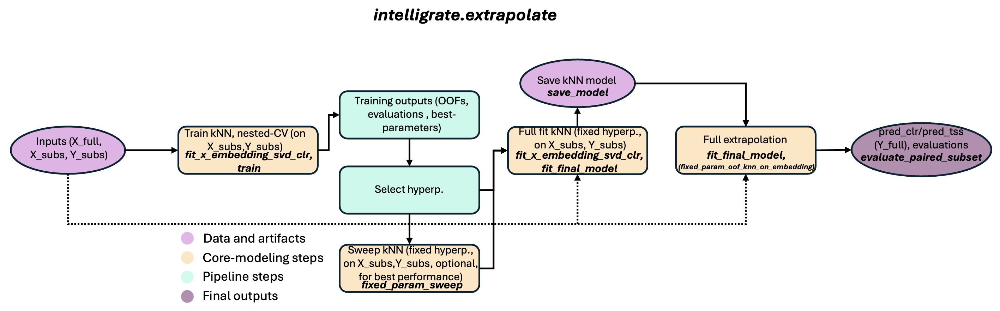

# intelligrate.extrapolate Tutorial

See also:
- `../README.md` (project overview + quickstart)
- `TUTORIAL_subset.md` (sample subsetting workflow)
- `notebooks/02_extrapolate_train_evaluate_full_fit_predict_HF_sourdough.ipynb` (hands-on sourdough run)

This tutorial explains **what extrapolate does**, the **inputs and outputs**, and how to run:
- `train` (nested CV, hyperparameter selection, OOF predictions)
- `full_fit` (final model on all paired samples)
- `full_predict` (KOs for kmer‑only samples)

If you prefer a hands‑on run, see the notebook:
- `notebooks/02_extrapolate_train_evaluate_full_fit_predict_HF_sourdough.ipynb`

Additional dataset-specific notebooks are available for HMP, Indian cohort, and primates in
`docs/notebooks/`.

---

## What extrapolate does

 

`intelligrate.extrapolate` learns a **k‑NN model** that maps **ASV k‑mer profiles (X)** to **KO profiles (Y)** using paired amplicon–shotgun samples. It:
1) embeds k‑mers (CLR + SVD),
2) learns a k‑NN model (optionally with diagonal metric learning),
3) predicts KO profiles in CLR space,
4) converts predictions back to TSS (relative abundance).

It also reports OOD diagnostics (nearest‑neighbor distances to the training set) and allowes KO-level and pathway (or any other mapping) correspondence evaluations as compared to the ground truth.

---

## Inputs and outputs

Example datasets live in subfolders under `data/` in the GitHub repository. The pip package contains
the `intelligrate` library code; notebooks and example data are downloaded separately. You can run
the examples without cloning the full repository by downloading the notebook and the matching
`data/<dataset>/` folder into one working folder, then starting Jupyter from that folder.

Recommended layout for the sourdough example:
```
your_working_folder/
  02_extrapolate_train_evaluate_full_fit_predict_HF_sourdough.ipynb
  data/HF_sourdough/
    X_kmers.tsv
    X_kmers_full.tsv
    Y_kos.tsv
    picrust2_kos.tsv
    ko_to_superclass.tsv
  results/
```

Choose one dataset folder first, then use the files inside it. For example, the sourdough example
uses `data/HF_sourdough/`; other example folders include `data/hmp/`, `data/indian/`, and
`data/primates/`.

**Inputs (TSV)**
- `data/HF_sourdough/X_kmers.tsv` — paired samples, k‑mer features (rows = samples, columns = k‑mers)
- `data/HF_sourdough/X_kmers_full.tsv` — all samples (paired + unpaired), same k‑mers
- `data/HF_sourdough/Y_kos.tsv` — paired KO profiles (TPM or counts)
- `data/HF_sourdough/ko_to_superclass.tsv` — KO -> pathway/superclass mapping
- Optional: `data/HF_sourdough/picrust2_kos.tsv` — PICRUSt2 KO predictions for paired samples

Some example datasets use ASV feature table names instead of k‑mer names, for example
`data/hmp/X_ASVs.tsv` and `data/hmp/X_ASVs_full.tsv`. The required structure is the same:
paired `X`, full `X`, paired target `Y`, and optional baseline/mapping files.

**Outputs (in `results/`)**
- `oof_clr.tsv`, `oof_tss.tsv` — leakage‑free OOF predictions from nested CV
- `folds.tsv` — per‑fold metrics + best params
- `summary.json`, `summary.tsv` — overall metrics summary
- `model.joblib` — final fitted model (from `full_fit`)
- `pred*.clr.tsv`, `pred*.tss.tsv`, `pred*.diag.tsv` — predictions + diagnostics (from `full_predict`)
- Optional: `pred*.metrics.tsv` — evaluation if `--y-truth` is provided

---

## Installation
Recommended: create a dedicated Python environment with Python 3.10-3.12. Core Intelligrate is
intended for macOS, Linux, and Windows.

Using `venv` on macOS/Linux:
```
python -m venv intelligrate-env
source intelligrate-env/bin/activate
python -m pip install --upgrade pip
pip install intelligrate
```

Using `venv` on Windows PowerShell:
```
py -m venv intelligrate-env
.\intelligrate-env\Scripts\Activate.ps1
python -m pip install --upgrade pip
pip install intelligrate
```

Using conda or mamba on any platform:
```
conda create -n intelligrate python=3.11
conda activate intelligrate
pip install intelligrate
```

If you already have a suitable Python environment active, install directly into it:
```
pip install intelligrate
```

Verify the install:
```
python -c "import intelligrate; print('intelligrate import OK')"
intelligrate --help
intelligrate extrapolate --help
intelligrate extrapolate full-predict --help
```

The help output uses placeholders such as `PATH`, `TSV`, or `JOBLIB` to describe values you provide;
do not type bracketed usage text such as `[-h]` literally.

To run this notebook from the same environment, also install a notebook interface:
```
pip install notebook ipykernel
```

For development only, clone the repository and install editable:
```
pip install -e .
```

---

## 1) Train (nested CV, hyperparameter selection)
Training uses **nested CV** to avoid leakage and returns **OOF predictions**.

Run with default config:
```
make score
# or
intelligrate extrapolate write-config --out configs/default.yaml
intelligrate extrapolate train --config configs/default.yaml
```

For config-driven runs, paths in the `data:` section are interpreted relative to `data/`.
Use dataset-relative paths such as `HF_sourdough/X_kmers.tsv`,
`hmp/X_ASVs.tsv`, `indian/X_ASVs.tsv`, or `primates/X_ASVs.tsv`.
If you installed `intelligrate` with pip and did not clone the repository, use
`intelligrate extrapolate write-config --out configs/default.yaml` to write an editable config
template into your working folder. Then edit the paths under `data:` so they point to the example
data folder you downloaded from GitHub or to your own tables.

What you get in `results/`:
- `oof_clr.tsv`, `oof_tss.tsv`
- `folds.tsv` (fold metrics + selected params)
- `summary.json`, `summary.tsv`

Key numbers to interpret:
- `OBJECTIVE_DM_SPEARMAN_MEAN`: average fold objective during nested CV
- `model_dm_union_strict`: KO‑union Aitchison DM Spearman for the model (strict; no row‑dropping)
- `picrust2_dm_union_strict`: KO‑union Aitchison DM Spearman for PICRUSt2 (if provided, strict)

**Metric set definitions (no row‑dropping)**
- **union_raw**: KO‑union of truth and prediction, **no detect threshold** (threshold = 0), fill missing KOs with 0.
- **union_strict**: KO‑union of truth and prediction, **with detect threshold**, fill missing KOs with 0.
- **intersection**: KO‑intersection only (KOs present in both truth and prediction tables); intersection metrics are computed on that shared KO set.

**Parameter impact (quick guide)**
- `min_prev_x_abs`: higher → fewer marker features; faster, but risk dropping signal.
- `n_components`: higher → richer embedding, but noisier/overfit risk.
- `neigh_k`: higher → smoother predictions; lower → more local, noisier.
- `tau_mult`: higher → broader kernel; lower → sharper local weighting.
- `y_latent_k`: helps with large KO tables; too high can add noise.
- `y_detect_threshold`: higher → more sparsity in union_strict evaluation.
- `metric_max_pairs` / `metric_ridge`: stability vs speed of metric learning.
- `ood_shrink` / `ood_lam_*`: more shrink → safer on outliers, but can oversmooth.

**Key formulas**
- CLR: `CLR(x) = log(x) - mean(log(x))`
- kNN kernel weights: `w_i = exp(-d_i^2 / tau^2)`, normalized to sum to 1
- KO confidence: `confidence = conf_corr * conf_stab`

**Per‑KO confidence (OOF‑based, dataset‑stable)**
Use `ko_confidence_from_oof(...)` to score each KO by predictability and local stability. It combines:
- `conf_corr`: probability that OOF Spearman ≥ `r0` (Fisher‑z approximation with per‑KO n).
- `conf_stab`: probability that local neighbor dispersion is lower than a random‑neighbor null.
- `confidence = conf_corr * conf_stab` in [0, 1].

**Validation notebooks**
Additional notebook variants evaluate validation datasets (HMP, primates, Indian cohort, sourdough) in `docs/notebooks/`.

### Grid search (optional)
Add a `grid:` section in your config to sweep parameters (cartesian product). Example:
```
grid:
  model:
    y_detect_threshold: [1000.0, 2000.0, 3000.0]
    neigh_k_grid: [[16, 20], [24, 28]]
  embed:
    n_components: [64, 128]
```
The trainer runs all combinations and keeps the best `OBJECTIVE_DM_SPEARMAN_MEAN`.

---

## Optional: fixed-parameter sweep (stability-first)
If you want a **single fixed hyperparameter set** that performs well in leakage‑free OOF (i.e., stable
when parameters are fixed), run the fixed‑param sweep. This evaluates each combo using
`fixed_param_oof_knn_on_embedding` and ranks by `dm_union_strict`.

**Optional: pre‑filter Y before modeling**
If you want to pre‑filter KO features once (e.g., apply a detection threshold globally and keep zeros as informative), do it **before** any training/sweeps and then use the filtered `Y` everywhere downstream (training, fixed‑param sweep, evaluation, and PICRUSt2 comparisons). The notebook includes an “Optional: Pre‑filter Y before any modeling” cell showing where to plug this in.

Add to your config:
```
fixed_param_sweep:
  neigh_k: [20, 24, 28]
  tau_mult: [0.5, 1.0]
  y_latent_k: [10, 20]
  metric_ridge: [1.0, 2.5]
```

You can sweep any fixed‑parameter field (e.g., `lam`, `min_prev_y_abs`, `y_detect_threshold`,
`pseudocount_y`, `ood_lam_base`, `ood_lam_cap`, `use_metric_learning`, `outer_splits`, `seed`).
**Tip:** keep sweeps to ~3–4 parameters at a time; runtime grows quickly with larger grids.
**Important:** if a parameter is **not** listed in `fixed_param_sweep`, the sweep will use the value
from config. For parameters with a `*_grid` (e.g., `neigh_k_grid`), it will use that grid list.
To force a single value, list it explicitly in `fixed_param_sweep`.

Run:
```
intelligrate extrapolate write-config --out configs/default.yaml
intelligrate extrapolate fixed-param-sweep --config configs/default.yaml --out results/fixed_param_sweep.tsv
```

The output is a ranked table. Use the top row as your **fixed hyperparameter set** for
`fixed_param_oof_knn_on_embedding` and `full_fit`.

If you already have tables loaded (e.g., in a notebook), you can call
`run_fixed_param_sweep_explicit(...)` with explicit inputs and config dicts.

## 2) Full fit (final model on all paired samples)
This trains a **single deployable model** on all paired samples using fixed hyperparameters.

### Step A — Fit and save the embedding
```
python - <<'PY'
import joblib
import pandas as pd
from intelligrate.extrapolate.embedding import fit_x_embedding_svd_clr

X_full = pd.read_csv('data/HF_sourdough/X_kmers_full.tsv', sep='\t', index_col=0)
embed = fit_x_embedding_svd_clr(
    X_full,
    min_prev_x_abs=14,
    pseudocount_x=0.5,
    n_components=128,
    seed=0,
)
joblib.dump(embed, 'results/embed.joblib')
PY
```

### Step B — Fit the full model
```
intelligrate extrapolate full-fit \
  --x data/HF_sourdough/X_kmers.tsv \
  --y data/HF_sourdough/Y_kos.tsv \
  --embed-path results/embed.joblib \
  --model-out results/model.joblib \
  --neigh-k 12 \
  --tau-mult 2.0 \
  --lam 0.0 \
  --y-latent-k 10 \
  --use-metric-learning \
  --metric-ridge 2.5 \
  --metric-max-pairs 5000 \
  --ood-shrink \
  --ood-lam-base 0.15 \
  --ood-lam-cap 0.80
```

---

## 3) Full predict (kmer‑only samples)
Predict KOs for any k‑mer table (paired or unpaired):
```
intelligrate extrapolate full-predict \
  --model results/model.joblib \
  --x data/HF_sourdough/X_kmers_full.tsv \
  --out-prefix results/pred
```
Outputs:
- `results/pred.clr.tsv`
- `results/pred.tss.tsv`
- `results/pred.diag.tsv` (OOD diagnostics)

### Optional evaluation on paired subset
If you also pass `--y-truth`, the same metrics as in `train` are computed:
```
intelligrate extrapolate full-predict \
  --model results/model.joblib \
  --x data/HF_sourdough/X_kmers.tsv \
  --y-truth data/HF_sourdough/Y_kos.tsv \
  --out-prefix results/pred_paired
```
This writes `results/pred_paired.metrics.tsv`.

---

## Leakage‑free paired evaluation (important!!!)
**Full‑fit** is trained on *all paired samples*, so evaluating those same samples is too optimistic.
If you want leakage‑free predictions **with fixed hyperparameters**, use the helper
`fixed_param_oof_knn_on_embedding` (see notebook) and replace paired rows in the full prediction table with these out-of-fold predictions instead.

---

## PICRUSt2 comparison
If `picrust2_kos.tsv` is provided in the config, `train` reports PICRUSt2 metrics and logs:
- `picrust2_dm_union_strict`, `model_dm_union_strict`, `delta_union`

Use these to compare against the baseline under identical scoring.

---

## Config reference (all parameters)
All parameters live in `configs/default.yaml`.

### data
- `x_full`: filename for all k‑mer samples (paired + unpaired)
- `x`: filename for paired k‑mer samples
- `y`: filename for paired KO table
- `picrust2`: optional PICRUSt2 KO table (paired samples)
- `ko_to_superclass`: KO -> pathway/superclass mapping

### cv
- `outer_splits`: outer CV folds (higher = slower, more stable)
- `inner_splits`: inner CV folds for hyperparameter selection
- `seed`: random seed for CV and SVDs
- `informed_splits`: use KMeans‑informed splits (clusters X only; avoids target leakage)

### embed
- `min_prev_x_abs`: minimum prevalence for k‑mers kept in embedding
- `pseudocount_x`: pseudocount for CLR in X embedding
- `n_components`: SVD components for X embedding

### model
- `min_prev_y_abs`: minimum prevalence for KOs retained per fold
- `y_detect_threshold`: absolute count threshold used in prevalence filtering
- `pseudocount_y`: pseudocount for CLR in Y
- `neigh_k_grid`: k‑NN neighborhood sizes (grid)
- `tau_mult_grid`: kernel width multipliers (grid)
- `lam_grid`: shrinkage toward global mean (grid)
- `y_latent_k_grid`: number of latent Y SVD components (grid; 0 = no latent)
- `use_metric_learning`: learn diagonal metric in embedding space
- `metric_max_pairs`: max pairs sampled for metric learning
- `metric_ridge_grid`: ridge values for metric learning (grid)
- `ood_shrink`: enable OOD shrinkage
- `ood_shrink_inner`: apply OOD shrinkage during inner CV
- `ood_lam_base`: base shrinkage coefficient for OOD
- `ood_lam_cap`: cap for OOD shrinkage
- `ood_tau_inflate`: inflate tau based on OOD distances

### objective
- `w_dm`: weight for Aitchison DM Spearman (primary)
- `w_wclr`: weight for weighted CLR MSE (optional)
- `w_pw_rmse`: weight for pathway RMSE (optional)
- `w_softf1`: weight for thresholded F1 (optional)
- `w_jsd`: weight for Jensen‑Shannon divergence (optional)

### prf
- `prf_thresh`: threshold for presence/absence metrics in TSS
- `prf_weight`: weighting scheme (`binary`, `truth_abundance`, `pred_abundance`)

### metrics (optional reporting only)
- `compute_wclr`: compute weighted CLR MSE
- `compute_jsd`: compute Jensen‑Shannon divergence
- `compute_pathway_rmse`: compute pathway RMSE (overall)
- `pathway_rmse_per_group`: compute per‑pathway RMSE table
- `pathway_rmse_log1p`: log1p transform for pathway RMSE

### score
- `min_prev_y_abs`: prevalence filter for the optional global OOF check
- `y_detect_threshold`: detection threshold for that check
- `pseudocount_y`: CLR pseudocount for that check

### grid (optional)
Any numeric config value can be swept via:
```
grid:
  <section>:
    <parameter>: [values...]
```
The trainer runs the cartesian product and keeps the best `OBJECTIVE_DM_SPEARMAN_MEAN`.

## CLI parameter reference (full_fit / full_predict)
These are CLI arguments (not in the YAML config):

### full_fit
- `--x`: paired k‑mer table (TSV)
- `--y`: paired KO table (TSV)
- `--embed-path`: saved embedding (joblib)
- `--model-out`: output model path (joblib)
- `--min-prev-y-abs`: KO prevalence filter
- `--y-detect-threshold`: detection threshold for KO prevalence
- `--pseudocount-y`: CLR pseudocount for Y
- `--neigh-k`: k‑NN neighborhood size
- `--tau-mult`: kernel width multiplier
- `--lam`: shrinkage toward global mean
- `--y-latent-k`: number of latent Y SVD components
- `--use-metric-learning`: enable diagonal metric learning
- `--metric-ridge`: ridge for metric learning
- `--metric-max-pairs`: max pairs for metric learning
- `--tau-scale-k-nn`: neighbor count for tau scaling
- `--ood-shrink`: enable OOD shrinkage
- `--ood-lam-base`: base OOD shrinkage
- `--ood-lam-cap`: max OOD shrinkage
- `--seed`: random seed

### full_predict
- `--model`: trained model path (joblib)
- `--x`: k‑mer table to predict
- `--out-prefix`: output prefix for `*.clr.tsv`, `*.tss.tsv`, `*.diag.tsv`
- `--y-truth`: optional paired KO table for evaluation
- `--pseudocount`: CLR pseudocount for evaluation
- `--detect-threshold`: detection threshold for union evaluation
- `--prf-thresh`: threshold for precision/recall/F1
- `--prf-weight`: weighting scheme for precision/recall/F1


See also:
- `../README.md`
- `TUTORIAL_subset.md`
