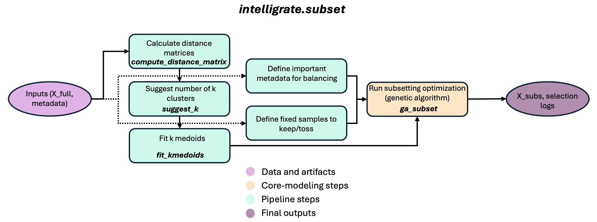

# intelligrate.subset Tutorial

See also:
- `../README.md` (project overview + quickstart)
- `TUTORIAL_extrapolate.md` (KO extrapolation workflow)
- `notebooks/01_subset_kmedoids_ga_selection.ipynb` (hands‑on run)

This tutorial explains **what subset does**, the **inputs and outputs**, and how to run it via:
- the Python API (recommended)
- the CLI configs (same steps)

If you prefer a hands‑on run, see the notebook:
- `notebooks/01_subset_kmedoids_ga_selection.ipynb`

---

## What subset does
 

`intelligrate.subset` helps select a **representative subset** of samples for shotgun sequencing by balancing:
- **diversity** in feature space
- **metadata coverage** (categories you care about)
- **geographic spread** (optional)

It does this using:
1) a distance matrix from a feature table,
2) k selection diagnostics,
3) k‑medoids clustering,
4) a genetic algorithm (GA) to pick the final subset.

**Parameter impact (quick guide)**
- `metric` (distance): bray = abundance‑aware; jaccard = presence/absence. Choice affects diversity signal.
- `k` (k‑medoids): higher k yields more clusters (finer stratification), but increases GA complexity.
- `gap_B`: more bootstrap draws = more stable k diagnostics, slower runtime.
- `population_size` / `generations`: larger values improve GA search but increase runtime.
- `balance_vars`: more balancing categories increases fairness but can reduce diversity if too strict.
- `coord_vars`: adds geographic spread to the objective.

**Key formulas (intuition)**
- Distance matrix `D` drives clustering and diversity scores.
- GA objective combines diversity + balance penalties (higher is better).

---

## Inputs and outputs (at a glance)

Example datasets live in subfolders under `data/` in the GitHub repository. The pip package contains
the `intelligrate` library code; notebooks and example data are downloaded separately. You can run
the examples without cloning the full repository by downloading the notebook and the matching
`data/<dataset>/` folder into one working folder, then starting Jupyter from that folder.

Recommended layout for the subset example:
```
your_working_folder/
  01_subset_kmedoids_ga_selection.ipynb
  data/HF_sourdough/
    feature_table_rel.tsv
    metadata.tsv
  results/
```

Choose one dataset folder first, then use the files inside it. The subset example uses
`data/HF_sourdough/`.

**Inputs (TSV)**
- `data/HF_sourdough/feature_table_rel.tsv` — samples x features (relative abundance preferred)
- `data/HF_sourdough/metadata.tsv` — sample metadata (categories + optional lat/long)

**Outputs (in `results/subset/` by default)**
- `distance.tsv` + `distance_meta.json`
- `k_diagnostics.tsv` + `k_diagnostics.png`
- `kmedoids_clusters.tsv` + `kmedoids_cluster_counts.tsv`
- `ga_selected_samples.tsv` + `ga_best_scores.tsv` + `ga_fitness_array.tsv` + `ga_meta.json`

---

## Installation
Recommended: create a dedicated Python 3.10-3.12 environment. Core Intelligrate is intended for
macOS, Linux, and Windows.

Using `venv` on macOS/Linux:
```
python -m venv intelligrate-env
source intelligrate-env/bin/activate
python -m pip install --upgrade pip
pip install intelligrate
```

Using `venv` on Windows PowerShell:
```
py -m venv intelligrate-env
.\intelligrate-env\Scripts\Activate.ps1
python -m pip install --upgrade pip
pip install intelligrate
```

Using conda or mamba on any platform:
```
conda create -n intelligrate python=3.11
conda activate intelligrate
pip install intelligrate
```

If you already have a suitable Python environment active, install directly into it:
```
pip install intelligrate
```

Verify the install:
```
python -c "import intelligrate; print('intelligrate import OK')"
intelligrate --help
intelligrate subset --help
intelligrate subset write-configs --help
intelligrate subset distance --help
intelligrate subset suggest-k --help
intelligrate subset kmedoids --help
intelligrate subset ga --help
```

The help output uses placeholders such as `PATH`, `TSV`, or `JOBLIB` to describe values you provide;
do not type bracketed usage text such as `[-h]` literally.

For config-driven CLI runs, write editable templates into your working folder:
```
intelligrate subset write-configs --out-dir configs
```
Then edit the YAML paths and parameters before running:
```
intelligrate subset run-config --config configs/subset_distance.yaml
```

To run this notebook from the same environment, also install a notebook interface:
```
pip install "intelligrate[notebooks]"
```

For development only, clone the repository and install editable:
```
pip install -e .
```

Optional geographic map plots in the subset notebooks require extra geospatial dependencies:
```
pip install "intelligrate[maps]"
```
If geospatial packages are difficult to install on your platform, create the environment with
conda/mamba and install `geopandas` and `contextily` from conda-forge.

---

## Python API (recommended)
This is the clearest way to run the workflow end‑to‑end.

### Step 1 — Compute a distance matrix
```
import pandas as pd
from intelligrate.subset import compute_distance_matrix

ft = pd.read_csv('data/HF_sourdough/feature_table_rel.tsv', sep='\t', index_col=0)
D = compute_distance_matrix(ft, metric='bray', assume_relative=True)
```

### Step 2 — Suggest k (diagnostics)
```
from intelligrate.subset import suggest_k

metrics = suggest_k(D, ft, k_range=range(2, 5), gap_B=2, random_state=42)
```
Use these diagnostics to **choose k** (this is not auto‑selected).

### Step 3 — Fit k‑medoids
```
from intelligrate.subset import fit_kmedoids

km = fit_kmedoids(D, k=3, random_state=42)
```

### Step 4 — Run the GA to select samples
```
from intelligrate.subset import ga_subset

md = pd.read_csv('data/HF_sourdough/metadata.tsv', sep='\t', index_col=0)
selected, best_scores, fitness = ga_subset(
    km['cluster_df'],
    md,
    total_samples=30,
    balance_vars=['r_samp_country', 'r_samp_source'],
    coord_vars=('latitude', 'longitude'),
    population_size=10,
    generations=3,
    random_state=42,
)
```

---

## CLI workflow (same steps)
The CLI exposes the same four workflow steps as explicit subcommands. Each command below writes to
`results/subset/`.

### Step 1 — Distance matrix
Run:
```
intelligrate subset distance \
  --feature-table data/HF_sourdough/feature_table_rel.tsv \
  --metric bray \
  --assume-relative \
  --output-dir results/subset
```
Outputs:
- `results/subset/distance.tsv`
- `results/subset/distance_meta.json`

### Step 2 — Suggest k
Run:
```
intelligrate subset suggest-k \
  --feature-table data/HF_sourdough/feature_table_rel.tsv \
  --distance-matrix results/subset/distance.tsv \
  --k-min 2 \
  --k-max 4 \
  --gap-B 2 \
  --seed 42 \
  --plot \
  --output-dir results/subset
```
Outputs:
- `results/subset/k_diagnostics.tsv`
- `results/subset/k_diagnostics.png`
- `results/subset/k_suggest_meta.json`

### Step 3 — Fit k‑medoids
Run:
```
intelligrate subset kmedoids \
  --distance-matrix results/subset/distance.tsv \
  --k 3 \
  --seed 42 \
  --output-dir results/subset
```
Outputs:
- `results/subset/kmedoids_clusters.tsv`
- `results/subset/kmedoids_cluster_counts.tsv`

### Step 4 — GA subset selection
Run:
```
intelligrate subset ga \
  --cluster-table results/subset/kmedoids_clusters.tsv \
  --metadata-table data/HF_sourdough/metadata.tsv \
  --output-dir results/subset \
  --total-samples 30 \
  --balance-vars r_samp_country,r_samp_source \
  --metadata-weights r_samp_country=1.0,r_samp_source=0.5 \
  --latitude-col latitude \
  --longitude-col longitude \
  --population-size 10 \
  --generations 3 \
  --seed 42 \
  --min-category-n 2 \
  --min-per-category 2 \
  --grid-weight 3.0 \
  --distance-weight 2.0 \
  --balance-weight 1.0 \
  --balance-scale 1000.0 \
  --hard-penalty-weight 100.0 \
  --fixed-include configs/fixed_include.tsv
```
Outputs:
- `results/subset/ga_selected_samples.tsv`
- `results/subset/ga_best_scores.tsv`
- `results/subset/ga_fitness_array.tsv`
- `results/subset/ga_meta.json`

---

## Parameter reference (all parameters)

### distance
- `feature_table`: samples x features (TSV)
- `metric`: `bray` | `jaccard` | `aitchison`
- `assume_relative`: set true if rows already sum to 1
- `pseudocount`: used for CLR in `aitchison`
- `output_dir`: output folder
- `distance_out`: optional custom path for `distance.tsv`

### suggest_k
- `distance_matrix`: path to precomputed distance matrix
- `k_min`, `k_max`: range of k values to test
- `gap_B`: reference sets for gap statistic
- `seed`: random seed
- `plot`: save diagnostic plot
- `feature_table`: the feature table used for alignment checks
- `output_dir`: output folder

### kmedoids
- `k`: chosen number of clusters
- `seed`: random seed
- `distance_matrix`: path to precomputed distance matrix
- `output_dir`: output folder

### ga
- `cluster_table`: k‑medoids cluster assignments
- `metadata_table`: metadata table
- `total_samples`: number of samples to select
- `balance_vars`: metadata columns to balance
- `metadata_weights`: optional weights per metadata field
- `coord_vars`: latitude/longitude column names (optional)
- `population_size`, `generations`: GA runtime settings
- `min_category_n`, `min_per_category`: category coverage constraints
- `grid_size`: spacing for geographic grid term (if coords are used)
- `grid_weight`, `distance_weight`, `balance_weight`: objective weights
- `balance_scale`: scales metadata balance term
- `hard_penalty_weight`: penalty for under‑represented categories
- `fixed_include`, `fixed_exclude`: fixed IDs to force include/exclude
- `seed`: random seed
- `output_dir`: output folder

---

## Additional notes
- `suggest_k` provides diagnostics; YOU choose k based on those curves.
- Start with small GA settings (small `population_size` and `generations`) to test quickly, increasing those makes results more stable, but runs slower.
- If your feature table is not relative abundance, set `assume_relative: false` (or normalize first).
- Geographic basemap plots in the subset notebooks are optional. Install `geopandas` and `contextily` with `pip install "intelligrate[maps]"` if you want to run those cells.

See also:
- `../README.md`
- `TUTORIAL_extrapolate.md`
